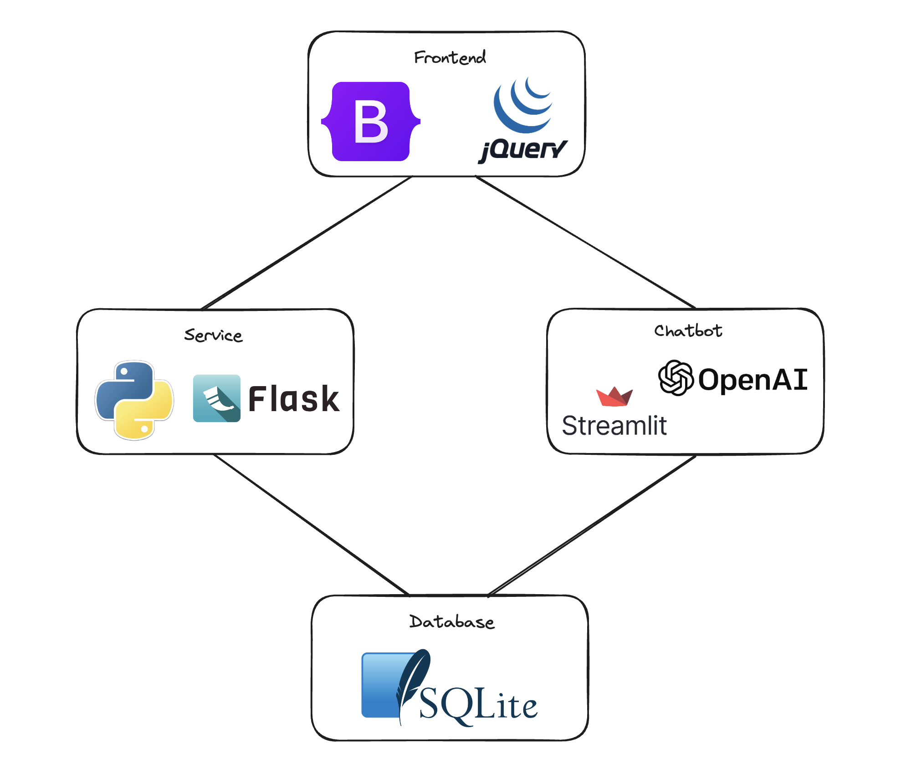

# Partners Portal

## Overview

This is a full-stack web application that allows the school’s Career and Technical Education Department to manage their business and community partners. The application is built using Bootstrap, jQuery, Flask, SQLite, OpenAI, and Streamlit. The application has four main pages: List, Add, Report, and Chatbot. The List page displays a list of partners with the ability to filter, the Add page allows users to add a new partner, the Report page displays a report of the partners by category, and the Chatbot page allows users to interact with a LLM-backed chatbot.

**Architecture**:



---

## Instructions

List Page:


Add Page:


Report Page:


Chatbot Page:


---

## Initialization

Install Python: <https://www.python.org/downloads/>  

Install Requirements:

```bash
pip install -r requirements.txt
```  

Install SQLite: <https://www.sqlite.org/download.**html**>  

Run the Server:  

```bash
python3 main.py
```  

To use the chatbot, a valid API key is needed: <https://platform.openai.com/docs/api-reference/authentication>  

Run the Chatbot:

```bash
python3 -m streamlit run chatbot.py
```

---

## Backup Data

Export current database to a file (specify the backup directory):

```bash
export BACKUP_DIR=/path/to/backup/dir
```

Run the backup script:

```bash
./backup.sh
```

View list of cron jobs:

```bash
crontab -l
```

---

## Documentation

Boostrap: <https://getbootstrap.com/docs/5.3/getting-started/introduction/>  
jQuery: <https://api.jquery.com/>  
Flask: <https://flask.palletsprojects.com/en/3.0.x/>  
SQLite: <https://www.sqlite.org/docs.html>  
OpenAI: <https://platform.openai.com/docs/introduction>  
Streamlit: <https://docs.streamlit.io/knowledge-base/tutorials/build-conversational-apps#build-a-bot-that-mirrors-your-input>  
